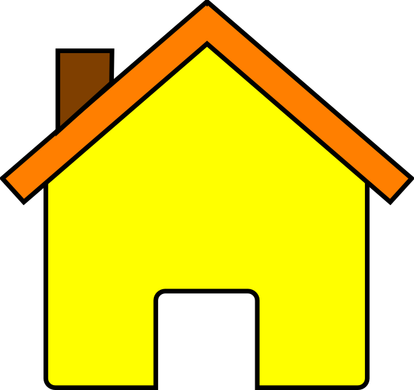
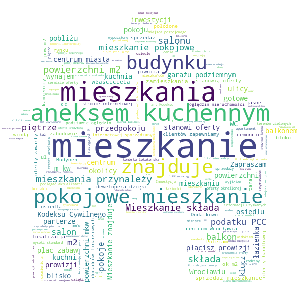

# Flats Description Scraper
### Scraper
This scraper is based on my previous otodom scraper, I thought that it might be a good idea to check the most frequently used words in flats offer descriptions.
I scraped 2 features from offer:
* offer id
* offer description
Next here is the screenshoot of how the data looks, saved in csv format:

### Description word cloud creation
For word cloud I needed to join all rows from DataFrame into one string.
First I used simple lambda function to get rid of "\n" characters,
Next I used stopword, usually refers to the most common words in a language (Wikipedia) for polish language, file with all words comes from:

**https://github.com/bieli/stopwords**

Then next step is to get picture of house or other things which are somehow connected with flats:

Last step is to print out this picture, it looks like this picture of the most frequent words used in flat offer descriptions:

Picture and know how found here, solution from Julia Kho:

**https://blog.goodaudience.com/how-to-generate-a-word-cloud-of-any-shape-in-python-7bce27a55f6e**
